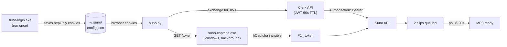

<div align="center">


# SunoTap

**Tap into Suno AI from your terminal.**

Generate music on [Suno AI v5.5](https://suno.com) without touching the web interface — scriptable, headless, agent-friendly.

[](https://python.org)
[-0078d4?logo=windows&logoColor=white)](#architecture)
[](https://suno.com)
[](LICENSE)

</div>

---

## What is this?

SunoTap is an **alternative client for your own Suno account**. It talks to the same API endpoints your browser uses, authenticated with your own session. No scraping, no account bypassing, no credit manipulation — just a cleaner interface for people who live in the terminal.

One login. Your session is saved. After that, it's pure HTTP — no browser process, no GUI. Works locally on Windows or from a headless Linux server/container.

---

## Architecture

SunoTap has two components. You need both.

```
┌─────────────────────────────────┐     ┌──────────────────────────────────────┐
│         Windows Machine         │     │       Linux / LXC / Headless         │
│                                 │     │                                      │
│  suno-login.exe  (run once)     │     │  suno.py generate                    │
│    └─ captures httpOnly cookies │     │    ├─ refreshes JWT via Clerk        │
│       saves ~/.suno/config.json │     │    ├─ calls captcha service          │
│                                 │     │    │    (HTTP → Windows:7825)        │
│  suno-captcha.exe  (background) │◄────┤    └─ submits to Suno API            │
│    └─ hidden WebView2 (Edge)    │     │                                      │
│       resolves hCaptcha silently│     │  python suno.py pair  (setup once)   │
│       HTTP server on port 7825  │     │    └─ UDP discovery → saves          │
│       tray icon, Exit menu      │     │         Windows IP in config.json    │
└─────────────────────────────────┘     └──────────────────────────────────────┘
```

**Why Windows is required:** Suno uses hCaptcha on every generation. The token can only be obtained from a real browser with a trusted user session. `suno-captcha.exe` runs a hidden Edge/WebView2 window loaded with your Suno session, solves the invisible captcha in under a second, and caches the result for 85 seconds. The CLI calls this service over your local network — no captcha prompt, no user interaction.

When Windows is off, the CLI fails gracefully (3s timeout, clear error). No network noise, no polling, no broadcasts during normal operation.

---

## How the full flow works



---

## Dependencies

### Windows machine

| Component | Purpose | Required |
|-----------|---------|----------|
| Windows 10/11 | Host for captcha service | Yes |
| WebView2 runtime | Browser engine for captcha (bundled with Edge, already on Windows 10/11+) | Yes |
| Rust + Cargo | Build `suno-login.exe` and `suno-captcha.exe` | Build only |
| Tauri CLI (`npm i -g @tauri-apps/cli`) | Build the `.exe` files | Build only |

### Linux / LXC (where `suno.py` runs)

| Component | Install |
|-----------|---------|
| Python 3.10+ | `apt install python3` |
| requests | `pip install requests` |

No browser, no GUI, no Chromium, no Playwright needed on Linux.

---

## Setup

### 1. Install Python dependencies (Linux/LXC)

```bash
pip install requests
```

Or use the Windows helper:
```bat
setup.bat
```

### 2. Log in (Windows, run once)

```bat
suno-login.exe
```

Opens a small window at suno.com/sign-in. Log in normally. When detected, saves your session cookies to `~/.suno/config.json` and closes with a ✓. Session lasts ~1 year.

> No `.exe`? Build from source: `cd suno-login && build.bat` (requires Rust + Tauri CLI).

### 3. Copy config to Linux (if running CLI on LXC)

```bash
scp ~/.suno/config.json user@lxc-host:/root/.suno/config.json
```

### 4. Start the captcha service (Windows, keep running)

```bat
suno-captcha.exe
```

Double-click it. A tray icon appears. It loads suno.com in a hidden WebView2 window, waits for authentication (~30s first run), then sits idle using minimal resources. Keep it running while you generate.

### 5. Pair the Linux CLI with the Windows service (once per machine)

On Linux:
```bash
python suno.py pair
```

On Windows, right-click the tray icon → **Pair with LXC...**

The Windows app broadcasts 5 UDP packets on the LAN. The Linux side receives the IP, saves it to `config.json`. Done — never needs to be repeated unless the Windows machine changes.

> **No pairing needed** if running `suno.py` directly on Windows — it connects to `127.0.0.1:7825` automatically.

---

## Generate

```bash
# Instrumental
python suno.py generate \
  --style "acoustic banjo, cinematic, orchestral swell, 68 BPM" \
  --title "Remnants of Kharak" \
  --wait

# With lyrics (file or inline text)
python suno.py generate \
  --style "indie folk, fingerpicking" \
  --title "My Song" \
  --lyrics lyrics.txt \
  --vocals \
  --wait

# Download MP3s when done
python suno.py generate \
  --style "..." --title "..." \
  --wait --download --out ~/music/suno

# All controls
python suno.py generate \
  --style "..." --title "..." \
  --exclude "drums, electric guitar" \
  --weirdness 70 \
  --style-influence 40 \
  --wait
```

---

## Commands

| Command | Description |
|---------|-------------|
| `python suno.py generate` | Generate a song |
| `python suno.py status` | Check auth state, JWT expiry, captcha service status |
| `python suno.py pair` | Discover and pair with `suno-captcha.exe` on LAN |
| `python suno.py auth` | Manual JWT paste (emergency fallback) |

---

## Flags

| Flag | Description | Default |
|------|-------------|---------|
| `--style` *(required)* | Styles, genres, instruments (comma-separated) | — |
| `--title` *(required)* | Song title | — |
| `--lyrics` | Lyrics: inline text or path to `.txt`. Omit → instrumental | — |
| `--vocals` | Include vocals | off |
| `--vocal-gender` | `male` / `female` (only with `--vocals`) | — |
| `--lyrics-mode` | `manual` / `auto` | Suno decides |
| `--exclude` | Styles to avoid (negative tags) | — |
| `--weirdness` | 0–100, divergence from conventional | 50 |
| `--style-influence` | 0–100, adherence to style tag | 50 |
| `--wait` | Block until generation completes | off |
| `--download` | Download MP3s when done (requires `--wait`) | off |
| `--out` | Output folder for MP3s | `~/music/suno` |
| `--token` | Explicit JWT (agent use) | — |
| `--captcha-token` | Explicit hCaptcha token (bypass service) | — |
| `--captcha-server` | Manual captcha capture via browser (fallback, no Windows service needed) | off |

---

## Captcha fallback (no Windows machine)

If `suno-captcha.exe` is not running, generation fails with a clear message. Two manual fallbacks:

**Option A — Interactive capture** (Linux with access to a browser):
```bash
python suno.py generate --captcha-server --style "..." --title "..." --wait
```
Shows a JS snippet. Paste it in suno.com's DevTools console (F12). Token is captured automatically.

**Option B — Explicit token:**
```bash
# In browser console at suno.com:
# (async()=>{const c=document.createElement('div');c.style.display='none';document.body.appendChild(c);const wid=window.hcaptcha.render(c,{sitekey:'d65453de-3f1a-4aac-9366-a0f06e52b2ce',size:'invisible'});const r=await window.hcaptcha.execute(wid,{async:true});copy(r.response);})()

python suno.py generate --captcha-token "P1_..." --style "..." --title "..." --wait
```

---

## Lyrics metatags

Suno v5.5 understands structural metatags inline with the lyrics:

```
[Intro - solo acoustic banjo, sparse, distant]
[Verse - melody unfolds, meditative]
[Build - picking quickens, pads emerge, tension]
[Chorus - full bloom, orchestral sweep, peak]
[Bridge - maximum power, triumphant]
[Outro - fades into silence]
```

---

## Exit codes

| Code | Meaning |
|------|---------|
| `0` | OK |
| `2` | Auth or captcha error — check `suno-captcha.exe` is running, or re-run `suno-login.exe` |
| `3` | Rate limit — wait a few minutes |
| `4` | API error — see message |
| `5` | Timeout — generation may still be running at suno.com |

---

## Project structure

```
suno-cli/
├── suno.py                  ← main CLI (Python)
├── setup.bat                ← install Python dependencies
│
├── suno-login.exe           ← login tool (pre-built)
├── suno-login/              ← source (Rust/Tauri v2)
│   ├── build.bat
│   └── src-tauri/src/main.rs   ← WebView2 COM cookie extraction
│
├── suno-captcha.exe         ← captcha service (pre-built)
├── suno-captcha/            ← source (Rust/Tauri v2)
│   ├── build.bat
│   └── src-tauri/src/main.rs   ← WebView2 hCaptcha + HTTP server + UDP pairing
│
└── assets/

~/.suno/config.json          ← session cookies + captcha service URL (never committed)
```

---

## Building from source

Both `.exe` files require [Rust](https://rustup.rs/) and the [Tauri CLI](https://tauri.app/start/):

```bash
npm install -g @tauri-apps/cli
```

```bat
# Login tool
cd suno-login && build.bat

# Captcha service
cd suno-captcha && build.bat
```

Each produces a ~2.5 MB self-contained executable in the project root. No Chromium, no Electron — just WebView2 (already on every Windows 10/11 machine via Edge).

---

## A note on responsible use

This tool is intentionally designed to be a **polite API client**.

The polling loop uses **human-like, jittered intervals** — not because the code can't poll faster, but because it shouldn't:

| Situation | Behavior |
|-----------|----------|
| Normal polling | 8–20s random interval (Gaussian, σ=3.5s) |
| Rate limited (HTTP 429) | Backs off 30–60s automatically |
| Network error | Retries after 9–18s |
| JWT near expiry | Proactively refreshes 120s before expiry |

> **Not affiliated with or endorsed by Suno AI.** Use in accordance with [Suno's Terms of Service](https://suno.com/terms).

---

## Agent use (LLM / voice server automation)

`suno.py` is designed to be called as a subprocess from agents. With `suno-captcha.exe` running on Windows and paired to the LXC, generation is fully autonomous:

```python
import subprocess

result = subprocess.run(
    ["python", "suno.py", "generate",
     "--style", "cinematic orchestral, epic brass",
     "--title", "Battle Theme",
     "--wait", "--download", "--out", "/music/output"],
    capture_output=True, text=True
)
# exit code 0 = success, MP3s in /music/output
# exit code 2 = captcha service down (suno-captcha.exe not running on Windows)
```

The captcha service is transparent to the agent — it either works silently or fails with a clear exit code.
