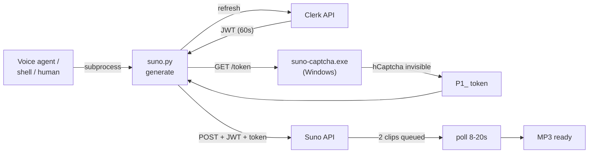

<div align="center">


# SunoTap

**Tap into Suno AI from your terminal.**

A scriptable, headless, agent-friendly client for [Suno AI v5.5](https://suno.com).
Generate music without ever opening the browser — and orchestrate it from voice agents,
shell scripts, or anything else that can spawn a subprocess.

[](https://python.org)
[](#why-windows-is-required)
[](https://tauri.app)
[](https://suno.com)
[](LICENSE)

</div>

---

## What is this?

SunoTap is an **alternative client for your own Suno account**. It talks to the same API endpoints your browser uses, authenticated with your own session. No scraping, no account bypassing, no credit manipulation — just a cleaner, more programmable interface for people who live in the terminal.

Built around three components, two of which run on Windows:

| Component | Purpose | Lives where |
|-----------|---------|-------------|
| `suno.py` | Main CLI — submits generations, polls, downloads MP3s | Anywhere with Python (Windows, Linux, LXC, headless servers) |
| `suno-login.exe` | First-time auth — captures `httpOnly` Clerk cookies | Windows |
| `suno-captcha.exe` | Background service — solves Suno's hCaptcha silently | Windows |

You log in **once**, the captcha service runs in your tray, and after that everything is pure HTTP — no browser, no GUI, no manual prompts.

---

## Why Windows is required

Suno wraps every generation request behind an **invisible hCaptcha challenge**. The token can only be obtained from a real browser running with a trusted user session — that's the entire point of hCaptcha.

We solve this with `suno-captcha.exe`: a tiny Tauri/Rust app that runs a hidden WebView2 (the same engine as Edge) loaded with your authenticated Suno session. When the CLI needs a token, it asks the service over HTTP, the WebView2 resolves the invisible widget in under a second, and the token comes back.

```
┌───────────────────────────────────────────────────────────────────┐
│                      Why a real browser?                          │
│                                                                   │
│  hCaptcha invisible mode evaluates browser fingerprint            │
│  (canvas, WebGL, fonts, behavioral signals) before issuing        │
│  a token. A headless solver gets blocked. A REAL Edge engine      │
│  with a logged-in Suno session gets a token in < 1 second.        │
│                                                                   │
│  WebView2 = literally the same engine as Edge.                    │
│  hCaptcha cannot tell them apart.                                 │
└───────────────────────────────────────────────────────────────────┘
```

The service uses **~24 MB of RAM idle**, makes **zero network requests when not generating**, and **shares the WebView2 runtime** with Edge (no second browser is downloaded or installed).

Don't have Windows? You can still use SunoTap with the [manual fallback](#captcha-fallback-without-windows) — paste a JS snippet in any browser when prompted.

---

## Architecture

```
┌────────────────────────────────────┐  ┌──────────────────────────────────────┐
│           Windows Machine          │  │   Linux / LXC / macOS / Anywhere     │
│                                    │  │                                      │
│  suno-login.exe        (run once)  │  │   suno.py generate                   │
│   └─ captures httpOnly cookies     │  │     ├─ refresh JWT (Clerk)           │
│      saves ~/.suno/config.json     │  │     ├─ ask captcha service ─────────┐│
│                                    │  │     └─ POST to Suno API             ││
│  suno-captcha.exe   (background)   │◄─┼─────────────────────────────────────┘│
│   ├─ hidden WebView2 + suno.com    │  │                                      │
│   ├─ HTTP server :7825             │  │   python suno.py pair  (one time)    │
│   ├─ UDP pairing on :7826          │  │     └─ UDP discovery → save          │
│   └─ tray icon w/ Pair + Exit      │  │         Windows IP in config.json    │
│                                    │  │                                      │
└────────────────────────────────────┘  └──────────────────────────────────────┘
```

### Generation flow



---

## Dependencies

### On Windows (required for captcha)

| Component | Required | Why |
|-----------|----------|-----|
| Windows 10/11 | Yes | Host for the captcha service |
| WebView2 runtime | Already present | Bundled with Edge — no install needed on Win 10/11 |
| Rust + Cargo | Build only | If you build the `.exe` files from source |
| Node + Tauri CLI | Build only | `npm install -g @tauri-apps/cli` |

### On Linux / LXC / wherever `suno.py` runs

| Component | Install |
|-----------|---------|
| Python 3.10+ | `apt install python3` |
| `requests` | `pip install requests` |

**No browser, no Chromium, no Playwright** needed on the Linux side. The CLI is pure HTTP + JSON.

---

## Setup

> **TL;DR for the impatient:**
> 1. `suno-login.exe` once → log in
> 2. Double-click `suno-captcha.exe` → tray icon appears
> 3. (Optional, for headless setups) Run `python suno.py pair` and click "Pair with LXC..." in the tray
> 4. `python suno.py generate ...` — done

### 1. Install Python dependencies

```bash
pip install requests
```

Or on Windows: `setup.bat` (also creates `~/.suno/`).

### 2. Log in (once, on Windows)

```bat
suno-login.exe
```

Opens a small window at suno.com/sign-in. Log in normally. When detected, it saves your full cookie set to `~/.suno/config.json` and closes with a ✓. **Sessions last ~1 year** — you won't need to do this again until well after the next Suno API rewrite.

> **No `.exe`?** Build it: `cd suno-login && build.bat` (needs Rust + Tauri CLI). Or use the [JWT-paste fallback](#manual-auth-fallback).

### 3. Start the captcha service (Windows)

```bat
suno-captcha.exe
```

Double-click and it goes straight to the system tray. ~30 seconds later it's ready. Keep it running while you generate — minimize the worry, not the window (it's already hidden).

The tray icon menu has two items:
- **Pair with LXC...** — broadcasts the connection details over your LAN (used once)
- **Exit** — close the service

### 4. (Optional) Headless setup — pair from a remote machine

If `suno.py` runs on a different machine than the captcha service (e.g., a Linux server, a Proxmox LXC, a voice agent), you need to tell the CLI where to find the service.

#### Option A — Terminal pairing

On the remote machine:
```bash
python suno.py pair
```

You'll see:
```
Waiting for suno-captcha.exe broadcast (30s)...
On Windows: right-click the tray icon -> 'Pair with LXC...'
```

On Windows, right-click the suno-captcha tray icon → **Pair with LXC...**

The Windows app broadcasts 5 UDP packets and shows a 4-digit pairing code in the tooltip. The remote terminal receives the broadcast, displays the IP and the code, and asks you to confirm:
```
Found: suno-captcha at http://192.168.1.x:7825
Pairing code: 4821  (verify it matches the Windows tray tooltip)
Save and test connection? [y/N]: y

Paired and verified. Captcha service: http://192.168.1.x:7825
```

The IP is saved to `~/.suno/config.json` as `captcha_service_url`. Done — never repeat unless your Windows IP changes.

#### Option B — Web app pairing (if you've integrated SunoTap into a web UI)

If you've built a web app on top of `suno.py` (e.g., a voice agent dashboard), the same UDP broadcast can drive a graphical pairing flow:

```
1. User opens "Pair captcha service" in the web UI
   → backend opens UDP listener on port 7826 (60s window)

2. User clicks "Pair with LXC..." on Windows tray
   → service broadcasts {ip, port, code} on the LAN
   → the 4-digit code shows in the tray tooltip

3. User reads the code, types it in the web UI input field

4. Backend validates the code matches a recent broadcast,
   saves captcha_service_url to ~/.suno/config.json,
   confirms with a health check
```

See [Building a pairing UI](#building-a-pairing-ui) for the protocol spec.

#### When pairing isn't needed

If `suno.py` runs **on the same Windows machine** as `suno-captcha.exe`, no pairing is needed — the CLI tries `http://127.0.0.1:7825` automatically.

---

## Generate

```bash
# Instrumental
python suno.py generate \
  --style "acoustic banjo, cinematic, orchestral swell, 68 BPM" \
  --title "Remnants of Kharak" \
  --wait

# With lyrics
python suno.py generate \
  --style "indie folk, fingerpicking" \
  --title "My Song" \
  --lyrics lyrics.txt \
  --vocals --vocal-gender female \
  --wait

# Download MP3s when done
python suno.py generate \
  --style "..." --title "..." \
  --wait --download --out ~/music/suno

# Fine-tune controls
python suno.py generate \
  --style "..." --title "..." \
  --exclude "drums, electric guitar" \
  --weirdness 70 \
  --style-influence 40 \
  --wait
```

---

## Commands

| Command | Description |
|---------|-------------|
| `python suno.py generate` | Generate a song |
| `python suno.py status` | Auth state, JWT expiry, session lifetime, captcha service health |
| `python suno.py pair` | Discover and pair with `suno-captcha.exe` over LAN (UDP) |
| `python suno.py auth` | Manual JWT paste (emergency fallback) |

---

## Flags for `generate`

| Flag | Description | Default |
|------|-------------|---------|
| `--style` *(required)* | Styles, genres, instruments (comma-separated) | — |
| `--title` *(required)* | Song title | — |
| `--lyrics` | Inline text or path to `.txt`. Omit → instrumental | — |
| `--vocals` | Include vocals | off |
| `--vocal-gender` | `male` / `female` (only with `--vocals`) | — |
| `--lyrics-mode` | `manual` / `auto` | Suno decides |
| `--exclude` | Negative tags (styles to avoid) | — |
| `--weirdness` | 0–100, divergence from convention | 50 |
| `--style-influence` | 0–100, adherence to style tag | 50 |
| `--wait` | Block until generation completes | off |
| `--download` | Download MP3s when done (requires `--wait`) | off |
| `--out` | Output folder for MP3s | `~/music/suno` |
| `--token` | Explicit JWT (agent use) | — |
| `--captcha-token` | Explicit hCaptcha token (bypass service) | — |
| `--captcha-server` | Manual capture mode (no Windows service needed) | off |

---

## Captcha fallback without Windows

If you can't or don't want to run `suno-captcha.exe`, two manual fallbacks exist.

### Interactive

```bash
python suno.py generate --captcha-server --style "..." --title "..." --wait
```

Prints a JS snippet. Open suno.com → F12 → Console → paste → Enter. Token is captured automatically.

### Explicit token

In the suno.com browser console:
```js
(async()=>{
  const c=document.createElement('div');
  c.style.display='none';
  document.body.appendChild(c);
  const wid=window.hcaptcha.render(c,{
    sitekey:'d65453de-3f1a-4aac-9366-a0f06e52b2ce',
    size:'invisible'
  });
  const r=await window.hcaptcha.execute(wid,{async:true});
  copy(r.response);
})()
```

Then:
```bash
python suno.py generate --captcha-token "P1_..." --style "..." --title "..." --wait
```

Tokens last ~90 seconds.

---

## Lyrics metatags

Suno v5.5 understands structural metatags inline with lyrics:

```
[Intro - solo acoustic banjo, sparse, distant]
[Verse - melody unfolds, meditative]
[Build - picking quickens, pads emerge, tension]
[Chorus - full bloom, orchestral sweep, peak]
[Bridge - maximum power, triumphant]
[Outro - fades into silence]
```

---

## Exit codes

For use in scripts and agents:

| Code | Meaning | What to do |
|------|---------|------------|
| `0` | OK | — |
| `2` | Auth or captcha service error | Run `suno-login.exe`, or check `suno-captcha.exe` is running |
| `3` | Rate limit (HTTP 429) | Wait a few minutes |
| `4` | API error | Read the message |
| `5` | Timeout | Generation may still be running on suno.com |

stderr distinguishes the two cases of exit code 2 — `AUTH ERROR:` vs `CAPTCHA ERROR:` — so wrappers can give the user a useful message.

---

## Building a pairing UI

If you're integrating SunoTap into a web app or custom UI, the pairing happens via UDP. Here's the protocol.

### Flow

```
Web UI                                  suno-captcha.exe (Windows)
  │                                          │
  ├─ user clicks "Pair"                      │
  │   open UDP listener on :7826             │
  │   (60s window)                           │
  │                                          │
  │                    user clicks tray menu │
  │                       "Pair with LXC..." │
  │                                          │
  │  ◄─── 5x UDP broadcast :7826 ────────────┤   tooltip shows
  │       {"ip":"...","port":7825,           │   "Pairing code: 4821"
  │        "code":"4821"}                    │   for 60s
  │                                          │
  │  store {ip, port, code} in memory        │
  │                                          │
  ├─ user reads "4821" from tooltip,         │
  │   types it in UI input field             │
  │                                          │
  │  validate code matches a recent          │
  │  broadcast → save captcha_service_url    │
  │  to ~/.suno/config.json                  │
  │                                          │
  ├─ optional: GET /health to verify         │
  │   service responds                       │
  │                                          │
  └─ ✓ "Paired"
```

### Backend endpoints (suggested)

```
POST /api/pairing/start
  → opens UDP listener for 60s, returns { listening_until }

POST /api/pairing/submit  { code }
  → validates code matches a broadcast received within 60s,
    saves config, runs health check,
    returns { ok, ip, error? }

GET  /api/pairing/status
  → returns { listening, listening_until, current_service_url }
```

### Notes for implementers

- Bind UDP socket with `SO_REUSEADDR` to avoid stale bind errors.
- Run the listener on a separate task — don't block your main loop.
- Merge `captcha_service_url` into existing `config.json`. **Do not overwrite the file** — it contains the auth cookies and JWT.
- The captcha service responds to `GET /health` with `{"status":"ok","ready":true}` once it's ready (~30s after launch, after Clerk handshake completes).

---

## Project structure

```
suno-cli/
├── suno.py                  ← main CLI (Python)
├── setup.bat                ← Python deps installer
│
├── suno-login.exe           ← login tool (pre-built, 2.5 MB)
├── suno-login/              ← source (Rust/Tauri 2)
│   ├── build.bat
│   └── src-tauri/src/main.rs    ← WebView2 COM cookie extraction
│
├── suno-captcha.exe         ← captcha service (pre-built, 2.5 MB)
├── suno-captcha/            ← source (Rust/Tauri 2)
│   ├── build.bat
│   └── src-tauri/src/main.rs    ← WebView2 hCaptcha + HTTP + UDP pairing
│
├── assets/Logo-sunotap.png
├── README.md
└── LICENSE

~/.suno/config.json          ← session cookies + service URL (never committed)
```

---

## Building from source

Both `.exe` files are pre-built in the repo. To rebuild:

```bash
# One-time install
npm install -g @tauri-apps/cli
# Rust: https://rustup.rs/

# Login tool
cd suno-login && build.bat

# Captcha service
cd suno-captcha && build.bat
```

Each produces a self-contained `.exe` (~2.5 MB) in the project root. **No Chromium, no Electron** — just WebView2, which ships with every Windows 10/11 machine via Edge.

---

## Responsible use

This tool is intentionally designed to be a **polite API client**.

The polling loop uses **human-like, jittered intervals** — not because the code can't poll faster, but because it shouldn't:

| Situation | Behavior |
|-----------|----------|
| Normal polling | 8–20s random interval (Gaussian, σ=3.5s) |
| Rate limited (HTTP 429) | Backs off 30–60s automatically |
| Network error | Retries after 9–18s |
| JWT near expiry | Proactively refreshes 120s before expiry |

Suno's servers are doing real generative ML work. A full song takes 60–120s to render. Polling every 8+ seconds is more than sufficient and puts zero meaningful load on their infrastructure. The jitter ensures the request pattern looks like a human checking back, not a script hammering an endpoint.

> **Not affiliated with or endorsed by Suno AI.** Use in accordance with [Suno's Terms of Service](https://suno.com/terms).

---

## Agent use

`suno.py` is designed to be called as a subprocess from agents (LLMs, voice servers, automation pipelines). With `suno-captcha.exe` running on Windows and paired to the remote machine, generation is fully autonomous:

```python
import subprocess

result = subprocess.run(
    ["python", "suno.py", "generate",
     "--style", "cinematic orchestral, epic brass",
     "--title", "Battle Theme",
     "--wait", "--download", "--out", "/music/output"],
    capture_output=True, text=True
)

# exit 0 = success, MP3s in /music/output
# exit 2 + stderr starts "AUTH ERROR:"     = re-login on Windows
# exit 2 + stderr starts "CAPTCHA ERROR:"  = suno-captcha.exe not running
# exit 3 = rate limited
# exit 4/5 = API / timeout
```

The captcha service is transparent to the agent — it either works silently or fails with a clear, distinguishable exit code.

### Health check before generation

```bash
python suno.py status
```

Reports JWT validity, Clerk session days remaining, and captcha service health. Useful as a pre-flight check in long-running agents — call it on WebSocket connect or before each batch of generations to detect issues early.
